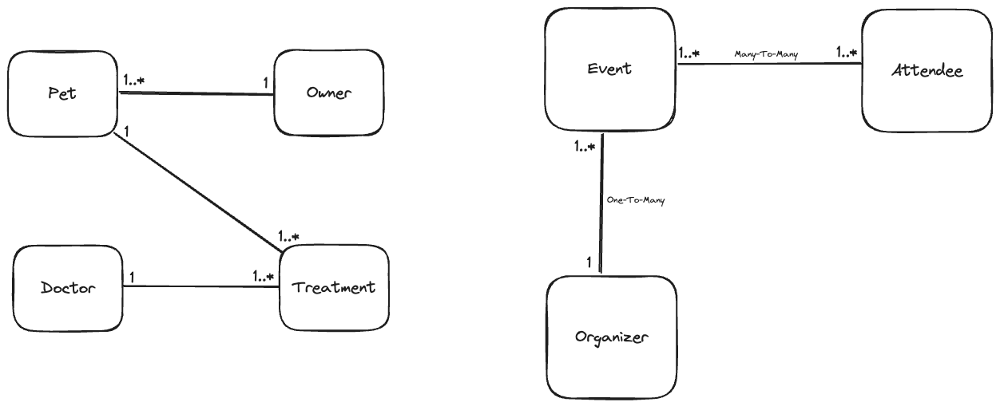

# Modellierung

> UML = Unified Modeling Language
> Graphische Methodik, wie Diagramme erstellt werden sollen

## Klassendiagramm

Beschreibt die Beziehungen zwischen den Modellen.
Die Multiplizitäten beschreiben die Art der Beziehung.

