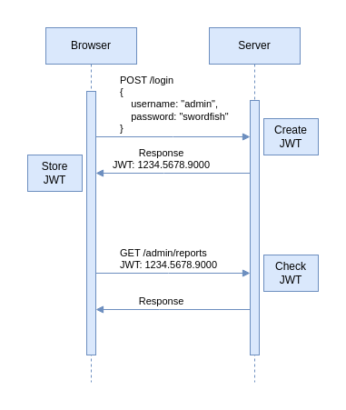

# JWT: Token Authentifizierung

> JWT = JSON Web Tokens

Es sind im Prinzip Tokens, die ein mehrere Informationen beinhalten (JSON) und eine Signatur!

Diese Signatur wird von einem Server erstellt.
Die Signatur ist ein Hash der mit einem Passwort und Paket des Tokens erstellt.

Signatur(Hash) = Geheimnis des Servers + Paket des Tokens + Header-Teil

Mit der Signatur kann sich ein Nutzer authentifizieren. Denn der Server kann die Signatur mit dem Paket dem gespeichertem Passwort überprüfen.

Vorteile:

- Speichern die Authentifizierung auf dem Client
  - Es benötigt keinen Speicher in der Datenbank
- Skalierbarkeit
- Relativ einfach

Nachteile:

- Wie kann man einen Token invalidieren?
- Alleinstehend hat der Token nur eine zeitliche Begrenzung
  - Diese Probleme lassen sich lösen, WENN man in der Datenbank speichert welche Tokens abgelaufen sind (UNNÖTIG)

## Authentifizierungsverfahren

- HTTP Anfragen sind zustandlos
- Wir können mittels dem Token, eine Anfrage eine Identität zu weisen

---

- Generieren von zufälligen Strings: `openssl rand -hex 12`

## Summary

- `jsonwebtoken`: Bietet die Funktionalität an, um mit Web Tokens zu arbeiten
- Web Token besteht aus drei Komponenten:
  - Header: Hashing-Algorithmus, Typ
  - Payload: Datenpaket (JSON)
    - Guter Ort, um Daten vom Server zu speichern, die lesbar sein sollen, aber nicht veränderbar
  - Signatur: Hash = Secret + Header + Payload
- Signatur gibt uns eine Bestätigung, dass der Server den Token erstellt hat
