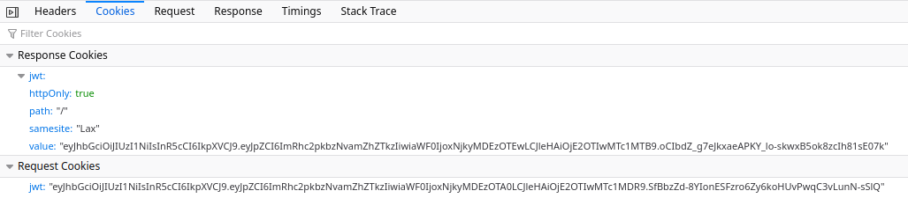

# HTTP-only Cookies

An HTTP-only cookie is a property added to a browser cookie that prevents client-side JavaScript from accessing the cookie data. This exercise will allow you to work with this security feature.

### Frontend

- The `/client` subfolder contains the frontend application
- To setup the frontend, run the command `npm run client-setup`

## Tasks

You will write a small backend application which creates and responds with a http only cookie on login. We will be using a MongoDB database for the user information. All of the frontend, and some of the backend code has already been created for you.

> 🐘 Use the `.env.example` file to set up your `.env` file, and connect your application to a database!

### Task 1 - The registration controller

All the routes and endpoints functions have been created, but you must complete the controller logic.

In the file [/controllers/user.js](./controllers/user.js), complete the controller for the `/registration` endpoint.

The controller should;

1. Take the registration information from the client **request** body object
2. Check to make sure the **username** is available
3. Use [bcrypt](https://www.npmjs.com/package/bcrypt) to create a hash of the password
4. Create a new user if all the expected details are applied

> Hint: Review `user` schema to see what data is expected!

### Task 2 - Testing registration

Run the server and open the registration page for the frontend in your browser ([http://localhost:3001/register](http://localhost:3001/register))

- Try registering a user. If user registration fails, the problem is likely to be in your controller.

### Task 3 - The login controller

In the file [/controllers/user.js](./controllers/user.js), complete the controller for the `/login` endpoint.

The controller should;

1. Take the login information from the client **request** body object
2. Check to make sure the user exists
3. Use **bcrypt** to verify the password matches with the user hash from the database

### Task 4 - Sending the JWT token from server to client

We would like the client to receive the JWT token after a successful login.

In your login controller, after you have validated that the user has provided the correct login details;

1. Generate a JWT token using the [issueJwt()](./libs/jwt.js) function
2. Send the token back to the client using a **httpOnly** cookie
3. Test your endpoint so ensure that the cookie (with the token) is being sent to the client

> Hint: To attach a cookie to the client response, you can use the **response** [cookie](http://expressjs.com/en/4x/api.html#res.cookie) method, for example:
>
> ```javascript
> res.cookie("jwt", token, {
>   httpOnly: true,
>   secure: false,
>   sameSite: "lax",
> });
> ```

### Task 5 - Test that the cookie with the JWT is returned when logging in

Open the login page for the frontend in your browser ([http://localhost:3001/login](http://localhost:3001/login))

- Use the login details to login a user. If the login fails, the problem is likely to be in your controller.
- Using your browser's developer tools, use the **network tab** to inspect the response from the server. You should be able to see the cookie in the response.

  

Now we have the http-only cookie stored safely in our browser, let's try using it to authorize a request!

### Task 6 - Creating the authorization middleware

To secure our endpoints from unauthorized access, we will work on the authorization middleware. Later we will attach it our endpoint.

In the file [/middlware/auth.js](./middleware/auth.js);

1. Import the [verifyJwt()](./libs/jwt.js) function
2. Use the `verifyJwt` function to verify the JWT in the http-only cookie (it should be available under the **request** object as `req.cookies.jwt`)
3. If the `verifyJwt` function returns **false**;

   - send a **response** to the user with the status code `401` and the message `"Unauthorized"`
   - the function should not continue running

4. If the `verifyJwt` **succeeds**, it will return the contents of the token as an object;

   - run the `next()` function to continue processing the request

### Task 7 - Attaching the auth middleware to the admin endpoint

Add the `authorizeJwt` middleware to the `/admin` route

### Task 8 - Testing!

With your server running (`node server.js`);

- Try [logging](http://localhost:3001/login) into your application and see if you're authorized to view the [admin](http://localhost:3001/admin) page!
